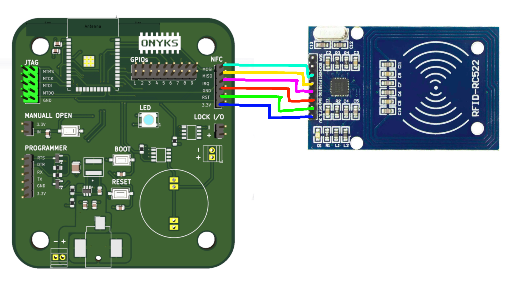
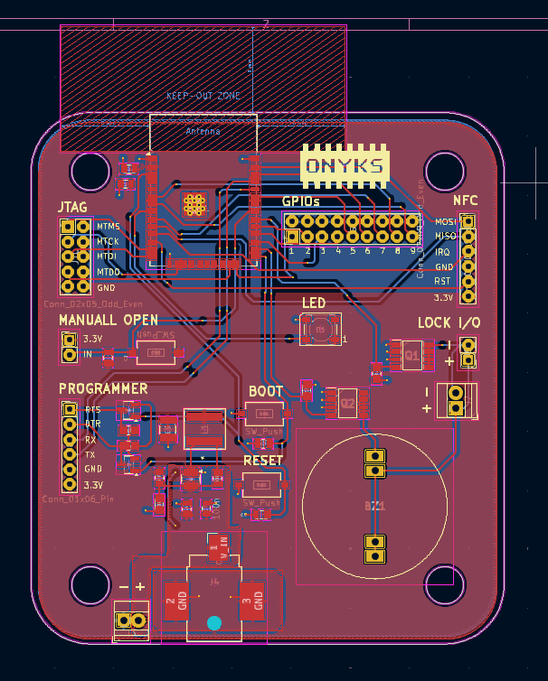
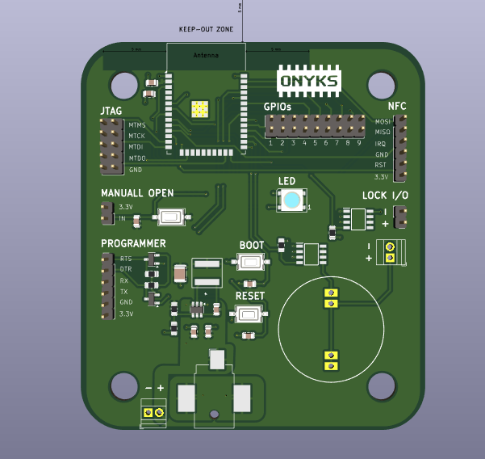

# Onyks IoT Control Cabinet

## Description

This device is part of the IoT project, which this part functions as locker for the cabins.
The devices is equiped with RFID MIFARE detector which detects student ID cards, it also has Wi-fi and Bletooth connection for database access.

## Features
* Two ways of power supply:
    - Terminal block;
    - DC Jack;
* Access for JTAG I/O ports;
* Access for programmer I/O ports;
* GPIO ports with GND;
* A buzzer turns on when the cabinet opens;
* An external header for an NFC external sensor by SPI transmission;
* An LED diod;
* Boot and Reset buttons;
* An external input for open the lock by e.g an external button;
* A button for opening the lock;
* Two ways of connecting the lock
    - a pin header;
    - terminal block;
* The voltage which is on the lock I/O port is like the power supply input voltage, e.g. when we have 12 V supply we have 12 V on the lock I/O ports;
* M6 screw holes to mounting.

Teorically when we have:
* 12 V, 2A (24 W) power supply we can power the lock which need 12 V and 1.2 A;
* 9 V, 2 A (18 W) power supply we can power the lock which need 9 V and 1 A;
* If the buzzer was replaced with higher voltage buzzer, then the device can operate with 24 V, 1 A (24 W) power supply;

* Used buzzer voltage range : 6 V - 18 V.

### Schematic

[[LINK]](docs/schematics.pdf)

## Images

#### Connection schematic with an external NFC module

### PCB

#### PCB View

#### 3D View

## Authors
* Karol Ambroziński
* Jakub Jastrzębski
